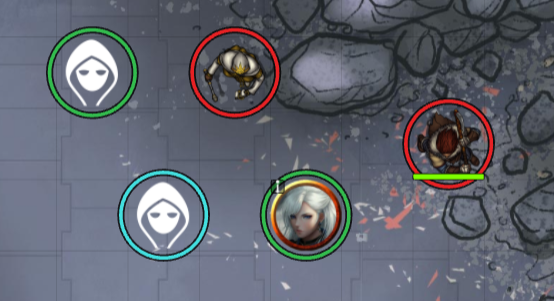
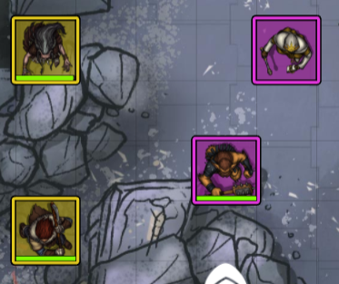
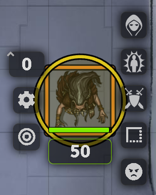
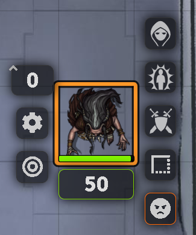

# Faction Tokens


This module will allow you to assign tokens to factions by using the token's disposition colors, the token actor's folder color, or defining your own custom replacement colors for token dispositions.


Artwork and assets kindly provided by and used with permission of Caeora. [www.caeora.com](http://www.caeora.com)

## NOTE: If you are a javascript developer and not a typescript developer, you can just use the javascript files under the dist folder

## Installation

It's always easiest to install modules from the in game add-on browser.

To install this module manually:
1.  Inside the Foundry "Configuration and Setup" screen, click "Add-on Modules"
2.  Click "Install Module"
3.  In the "Manifest URL" field, paste the following url:
`https://raw.githubusercontent.com/p4535992/token-factions/master/src/module.json`
4.  Click 'Install' and wait for installation to complete
5.  Don't forget to enable the module in game using the "Manage Module" button

### libWrapper

This module uses the [libWrapper](https://github.com/ruipin/fvtt-lib-wrapper) library for wrapping core methods. It is a hard dependency and it is recommended for the best experience and compatibility with other modules.

## Known issue

- There is a incompatibility with the module [Foundry VTT Mount Up](https://github.com/p4535992/MountUp ) when i "Mount Up" a faction token the PIXI Graphic go in conlict and launch a exception is not a grave exception but is annoying

- There is a incompatibility with the module [Perfect vision](https://github.com/dev7355608/perfect-vision ) when both module are active everything is broken

- The old "BLevel" frame style not work anymore, but i'll try for the feature to make more customizable faction image, there are already may options, but i don' have time for all the others. FOR NOW JUST USE THE FLAT SETTING


## Configuration


### Generate Token Faction Color From

- A Token's Disposition
- An Actor's Folder Color
- A Custom Color Set For Token Disposition

#### Default: A Token's Disposition

This option uses the default Token Disposition color to render the token base and frame. Token Disposition can be seen on a token's Character tab. Tokens with actors controlled by players are colored in a fourth, distinct color.


#### An Actor's Folder Color

This option uses the color of the folder a token's actor belongs in. A color of **#000000**, or the default color of a new actor folder, is treated as if there is no folder that will prevent a base and frame from being rendered for contained actor tokens.


#### [ON DEVELOPING] A Custom Color Set For Token Disposition

This option reveals additional configuration options allowing you to customize colors associated with each token disposition.


### Choose shape of your faction

Token frames (rings, square, hex) are layered above token graphics.







You can override this setting on a per-token basis on a token's Image tab if you use a mix of round and irregular tokens.


### Frame Render Style

#### [FOR NOW IS THE ONLY AVAIABLE OPTION] Default: Flat 

This option renders the frame in a flat color.


#### [REMOVED] Beveled

This option renders the frame in a beveled style typically seen surrounding round tokens.


### Frame/Border Width (Percent of Grid Unit)

This allows you to change the thickness of the rendered frame. The percentage is based on the width of a single grid unit, not the token width, so larger and smaller tokens will have a consistent frame size.


### Base Opacity

Setting this value to anything lower than 1 will allow the map background to be seen through the base. Setting this value to 0 will disable drawing the base entirely.

### Frame Opacity

Setting this value to anything lower than 1 will allow the map background or token to be seen through the frame. Setting this value to 0 will disable drawing the frame entirely.

### Enable/Disable the faction on the single token on the canvas

You can enable/disable the faction style for single token with a new hud button





## License

This module is licensed using the MIT License, any adaptations must provide both credit and indication of changes made.

# Build

## Install all packages

```bash
npm install
```
## npm build scripts

### build

will build the code and copy all necessary assets into the dist folder and make a symlink to install the result into your foundry data; create a
`foundryconfig.json` file with your Foundry Data path.

```json
{
  "dataPath": "~/.local/share/FoundryVTT/"
}
```

`build` will build and set up a symlink between `dist` and your `dataPath`.

```bash
npm run-script build
```

### NOTE:

You don't need to build the `foundryconfig.json` file you can just copy the content of the `dist` folder on the module folder under `modules` of Foundry

### build:watch

`build:watch` will build and watch for changes, rebuilding automatically.

```bash
npm run-script build:watch
```

### clean

`clean` will remove all contents in the dist folder (but keeps the link from build:install).

```bash
npm run-script clean
```
### lint and lintfix

`lint` launch the eslint process based on the configuration [here](./.eslintrc)

```bash
npm run-script lint
```

`lintfix` launch the eslint process with the fix argument

```bash
npm run-script lintfix
```

### prettier-format

`prettier-format` launch the prettier plugin based on the configuration [here](./.prettierrc)

```bash
npm run-script prettier-format
```

### package

`package` generates a zip file containing the contents of the dist folder generated previously with the `build` command. Useful for those who want to manually load the module or want to create their own release

```bash
npm run-script package
```

## [Changelog](./changelog.md)

## Issues

Any issues, bugs, or feature requests are always welcome to be reported directly to the [Issue Tracker](https://github.com/Voldemalort/token-factions/issues ), or using the [Bug Reporter Module](https://foundryvtt.com/packages/bug-reporter/).

## License

This package is under an [MIT license](LICENSE) and the [Foundry Virtual Tabletop Limited License Agreement for module development](https://foundryvtt.com/article/license/).

## Acknowledgements

Bootstrapped with League of Extraordinary FoundryVTT Developers  [foundry-vtt-types](https://github.com/League-of-Foundry-Developers/foundry-vtt-types).

Mad props to the 'League of Extraordinary FoundryVTT Developers' community which helped me figure out a lot.

## Credit

Thanks to anyone who helps me with this code! I appreciate the user community's feedback on this project!

- [Token Factions (original)](https://github.com/Voldemalort/token-factions) ty to [Voldemalort](https://github.com/Voldemalort)
- [Token Factions (fork)](https://github.com/erithtotl/token-factions) ty to [erithtotl](https://github.com/erithtotl)
- [Border-Control](https://github.com/kandashi/Border-Control) ty to [kandashi](https://github.com/kandashi)

